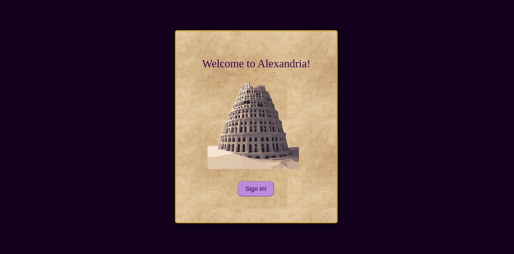

# Project-Alexandria

## Welcome to Alexandria!

To check out Alexandria yourself, visit [here](https://alexandria-4da0a.web.app/).
To check out the detailed documentation, visit [here](https://www.github.riyabelle25/Project-Alexandria)

<!--  -->

Project Alexandria is my attempt at cloning the Microsoft Teams App as part of the **Engage Mentorship Programme'21**.

The Great Library of Alexandria was one of the most significant libraries of the ancient world. It came to be regarded as the capital of learning and knowledge. Drawing inspiration from this, I visualised a **collaborative virtual infrastructure** where new spaces can be created for teams to meet and work.

Just as the Library of Alexandria was the hub for sharing of knowledge in the ancient times, I see platforms like **Teams** being the hub for collective working, growing and learning in these new times brought about by the Pandemic.

## Tech Stack

Although familiar with `NodeJs` projects, this was my first time coding in JS- especially working with `React` 😥.
I learnt on the get-go, and spent- sometimes hours on end debugging! It was challenging but in a good way.

Here's the tech stack involved for each of the functionalities:

- **App Authentication**: Firebase **Authentication** using Google Auth-Provider.

- **Video-Call Functionality's Back-End**: Used **`Express`** framework to code the server-side where my Client pings during a video-call. Code can be found at `server\index.js` from repository.

- **Video-Call Functionality**: Using `PeerJS` (wraps `WebRTC` ), `socket.io`\ `socket.io client`. Also using `STUN` servers to allow remote participation!

- **Client-side**: **`React JS` for Alexandria's front-end. ** `Redux` for users' state management. Code can be found under `client\` from repository. I have made good use of `@material-ui` and `mui-treasury` packages for building aesthetic UI components.

- **Database**: **Firestore database** for storing data on the cloud- for eg. the rooms a user has joined, the chat messages, and user information.

## Functionalities offered

To know more about the functionalities themselves, see the [docs](https://www.github.riyabelle25/Project-Alexandria):

- [Login](docs/login.md): In order to enter Alexandria, you need to sign-in with a Google account.

- [Home](home.md): You can see the list of users on your left and the list of joined Rooms in the center. To add more rooms, click on `Join Rooms`

- [Call](docs/call.md): To instantly connect with a friend, click on `connect` besides their name from the user list. This shall redirect you to a meeting, and send your friend a notification pop-up asking them to join you. Please note that your friend will have to be signed-in and on the app interface in order to recieve the pop-up!

- [Chat](docs/dm.md): Chat feature is available throughout Alexandria. You can send a direct message to a friend from the Home, or chat with room-members from a particular Room.

- [Rooms](docs/rooms.md): Each Room is modelled after a Team from the Microsoft Teams App. A Room is a virtual workspace made for team collaboration over a particular activity- be it a project, or a university course or even event management. Conversation can be maintained by creating `Channels` in a room, to keep discussions organised.

- [Meetings](docs/meetings.md): Group Video Calls; this is also the minimum functionality to be coded in for the Engage Mentorship Programme. Asides from directly calling an online user and have a one-on-one video call; Meetings can also be started from a Room itself, after which the meeting link can be copied and shared to invite others.

## Troubleshooting

I have tested Alexandria's functionalities out with my friends, seniors- even with my Mentor at the Engage Programme, multiple times; and know that everything is good. But then-

    `Murphy's Law: "Anything that can go wrong, will go wrong"`

Thus, the significance of this section.

- On Linux/MacOS, 100% zoom level works fine. If you're on Windows, 67% zoom level may be comfortable for you.
- If you encounter a blank page with just the app's background colour, reload the page.
- Please be patient with the Meeting Functionality- it _may_ take a few attempts for a second user to join the call, in case the `STUN` server urls aren't connecting (or your region is experiencing network issues). I have done my best to avoid this, by testing the urls on `ICETrickle` to see their status.
- If the video call drops, or the other user isn't able to join, switch to Windows OS.
- You need to be online with a good internet connection while using this app. Incase you run into problems with Firebase connections, a message will pop up.

## Build, and Host Locally:

    git clone https://github.com/Riyabelle25/Project-Alexandria.git
    cd alexandria
    npm install

Go to client/src/app/env.js and edit the `ENDPOINT` to this:
`const ENDPOINT = "http://localhost:8080";`

To deploy it locally:
`npm run dev`

To run tests locally:
`npm run test`

## Code Quality:

`Prettier` and `Eslint` has been used to maintain code quality as well as linting checks.

## CI/CD and Hosting:

- **Deployment** The Client is deployed on the Cloud using **Firebase Hosting** services- and my Server is deployed on **Azure using Web App Services**.
  The `server_url` (the URL where Server is deployed on Azure) is used in the client-side of Video-Call functionality for socket.io to make and get requests.
- **CI/CD** Project Alexandria is on **GitHub**. I use GitHub Actions for Firebase to run jobs for build deployments as well as linting checks.

## Testing:

React-testing libraries:
`@testing-library/jest-dom`,
`@testing-library/react`,
`@testing-library/user-event`,
`react-test-renderer`,  
along with `redux-mock-store`,` Jest``Enzyme ` has been used to write component tests.

## Documentation:

Used `mkdocs` to build a static documentation and serve it onto GitHub Project Pages.
