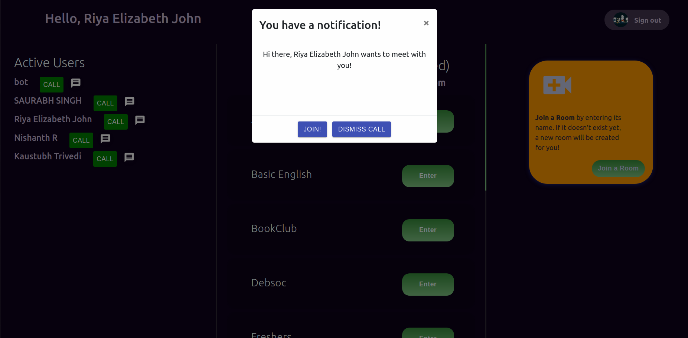

# Call a Friend and Start a Meeting Immediately

You can directly call another online user into a conference meeting.

To instantly connect with a friend, click on `connect` besides their name from the user list. To test this out alone, simply click on `connect` beside your own name.
This shall redirect you to a meeting, and send your friend (or you, if you called yourself) a notification pop-up asking them to join you.

Please note that your friend will have to be signed-in and on the app interface in order to recieve the pop-up!

## Explore

Calling somebody instantly starts a mutual meeting between the two of you. Note the URL, the `pairID` in the string. You'll see the same `pairID` in the mutual Chat URL.

As a sender you'll be instantly redirected to the Meeting UI, As the reciever, (if you're online and on the app interface) you shall get a pop-up notification. If you click on **join** you shall be redirected to the same meeting as the sender.

The Meeting UI is discussed more thoroughly in its section [here](meetings.md)

## Working

- Socket.io is used to emit and receive requests between Server and Clients, thereby allowing clients to communicate with the Express server when a user wants to notify their friend about the meeting.
- Say User A wants to meet User B. On clicking `connect`, User A emits a request body containing both their own `auth.currentUser` object and `user` object of User B along with the `meeting URL` (note the creation of `pairID` here) to server.

        // on clicking connect
        onClick={() => {
        socket.emit(
        "want-to-meet",
        {
        sender: auth.currentUser,
        receiver: user,
        meet: `/meeting/chat/${ ascii_to_hexa(auth.currentUser.uid.slice(0, 6)) + ascii_to_hexa(user.userID.slice(0, 6)) }`,
        },
        (response) => {
        console.log(response);
        console.log("ack");
        }
        );

- The ExpressJS Server (deployed on **Azure Web App services**) on receiving this packet, broadcasts it to all listening clients(i.e, users online and on the app interface)

        io.on("connection", (socket) => {
        console.log("new client connected");

        socket.on("want-to-meet", (data, ack) => {
            console.log("want-to-meet", data);
            ack("woot");

            io.emit("want-to-meet", data);
            console.log("emitted");
        });

- All clients on receiving this packet, check if the `reciever.uid` matches their own. User B, in this narrative matches, and successfully gets a pop-up.

        // client listening for call information. If successful match, react state updates and they get a notif.

        const socket = socketIOClient(ENDPOINT, { secure: true });
        socket.on("want-to-meet", (data) => {
            console.log("want-to-meet says server", data.receiver.userID);
            if (data.receiver.userID === auth.currentUser.uid) {
            console.log(data);
            setResponse(data);
            setShowModal(true);
            }
        });

## Troubleshooting

- For testing purposes, you may try calling yourself first.
- If, while testing with your friend you don't receive notif on their connecting with you, try sending your friend a notif instead (and vice-versa)
