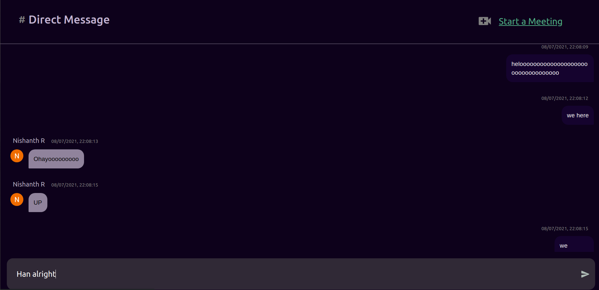

# Direct Message a fellow User

Your direct messages with someone are private, and can not be accessed by anyone else. In order to test this, feel free to chat with **bot** from the user list.

## Explore

Chat feature in Alexandria shows the **timestamp** of the message, along with the **userName** and **avatar** (profile picture) of the message sender (as obtained from their Google Account).

You can also start a meeting from here, which will redirect you to the Meeting UI. Any messages exchanged in a meet call shall come up as **Meeting Logs** in the Chat UI itself after meeting conclusion.

When on the DirectMessage UI, note the **ID string** in the URl. This ID is unique to just you and whoever you're chatting with (I call this a `pairID` ); I use this ID to store messages and handle events common to just the two of you (like starting a call)

## Working

- All messages are stored as documents under collection `dms\<pairID>\messages\`.

- The `pairID` for two users is obtained by taking a substring from each user's `uid`, converting both **ascii** strings to **Hexa** separately and then summing them.

        function ascii_to_hexa(str) {
        var arr1 = [];
        for (var n = 0, l = str.length; n < l; n++) {
        var hex = Number(str.charCodeAt(n)).toString(16);
        arr1.push(hex);
        }
        return parseInt(arr1.join(""), 16);
        }

## Troubleshooting

- If `Call Logs` do not show up after a meeting conclusion, please try again.
