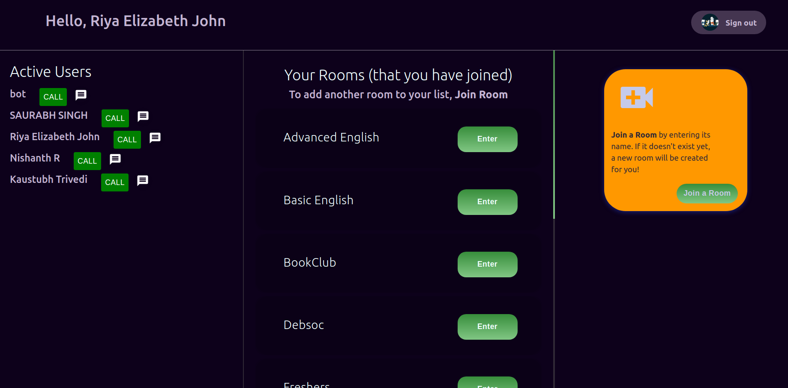

# Home

You can see the list of users on your left and your list of joined Rooms in the center. If this is your first time in Alexandria, there shall be only one room, i.e `BookClub` in your list. This means that you have been automatically added to `Bookclub` as a new user, and in order to add or join more rooms, click on `Join Rooms`.

<!--  -->

_How the Home Page looks like to a new user adding their first room_

## Explore

- **Join Room**: If you click on `Join Rooms`, you'll be prompted to enter a room name. The concept is similar to that of the Teams App, where you enter the Team Code and are subsequently added to the Team. If the Room does not already pre-exist, a new room shall be created.

- **Direct Message (Chat)**: From the list of users, click on the message icon to chat with a particular person. For testing purposes, you may chat with the **bot**. To know more, see [here](dm.md)

- **Call a friend/peer**: Click on `connect` from beside a user from the user list. Please note that the user you're calling has to be **online, signed in and on the app interface**. On doing so, they will get a pop-up notification inviting them to join your call. To know more, see [here](call.md)

## Working

- The URL of Home has been set as `/`. (This is the Base URL)

- Rooms are stored as `documents` in the Firestore, under collection `Rooms\`. Each Room document has an array attribute of `Users` which keeps track of the users who've joined that particular room. The document also has string attribute `roomName` which is the name of the Room.

        // Add a Room to Firestore
        const handleAddRoom = () => {
        const roomName = prompt("Enter a new room name");
        if (roomName) {
        db.collection("rooms").doc(roomName).set({ roomName: roomName });
        db.collection("rooms")
        .doc(roomName)
        .update({
        roomName: roomName,
        users: firebase.firestore.FieldValue.arrayUnion(
        `${auth.currentUser.email}`
        ),
        });

To know more about Firestore, see [here](https://firebase.google.com/docs/firestore/data-model)

- Using React Hooks `useState`, `useEffect` for effective state management. In Home, these are used to display Rooms and Users when the listener at Firestore detects a change.

        import React, { useState, useEffect } from "react";
        const [users, setUsers] = useState([]);

        // React Hook for managing Users
        useEffect(() => {
        db.collection("users")
        .orderBy("userName", "desc")
        .get()
        .then((querySnapshot) => {
        setUsers(
        querySnapshot.docs.map((doc) => ({
        userName: doc.data()["userName"],
        userID: doc.id,
        }))
        );
        })
        .catch((error) => {
        console.log("Error getting users", error);
        });
        }, [setUsers]);

## Troubleshooting

- In case your added Room does not show up immediately, please reload the page.
- In case a peer signs into the app (thereby becoming a new user) yet does not show up in the user-list, please reload the page
- You need to be online with a good internet connection while using this app. Incase of poor network, you shall not be able to see the addition of new Rooms or Users (as Firebase won't fetch and update state)
