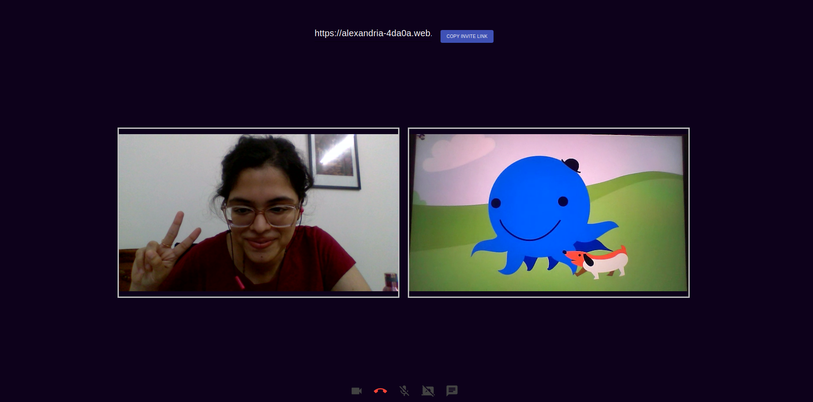

# Start a Meeting

One can start a meeting from any room, simply click on the hyperlink in the Header.
You'll be redirected to the pre-meeting UI, prompting you to fill in your name afterwhich you're in!

_Remote participation is facilitated! (Ps: that's my friend holding up Oswald😁 in the second video stream)_

## Explore

- To have others join in, copy the `invite link` from the top and share (You can drop the link in the Room-Chat!)

- When a participant joins, it may take some seconds to see their video-stream.

- Just like any other Meeting functionality, features like `mute/unmute`, switch `video on/off` and `share the screen` are available.

  _Share screen_:
  

- There is an `inbuilt chat` functionality as well. The chats from a meeting are displayed as `Meeting Logs` in that particular Room's ChatBox after a meeting ends.

  _Chat functionality_:
  

## Working

- Using `PeerJS` and `Socket.io` to write server-side code in `ExpressJS`:

        const express = require("express");
        const app = express();
        app.use(express.json());
        var server = http.Server(app);
        var io = require("socket.io")(server, { secure: true, allowEIO3: true });
        const { ExpressPeerServer } = require("peer");

        const peerServer = ExpressPeerServer(server, {
        debug: true,
        });
        app.use("/peerjs", peerServer);
        socket.on("join-call", (path) => {
            if (connections[path] === undefined) {
            connections[path] = [];
            }
            connections[path].push(socket.id);

            timeOnline[socket.id] = new Date();

            for (let a = 0; a < connections[path].length; ++a) {
            io.to(connections[path][a]).emit(
                "user-joined",
                socket.id,
                connections[path]
            );
            }

            if (messages[path] !== undefined) {
            for (let a = 0; a < messages[path].length; ++a) {
                io.to(socket.id).emit(
                "chat-message",
                messages[path][a]["data"],
                messages[path][a]["sender"],
                messages[path][a]["socket-id-sender"]
                );
            }
        }

- In Client-side, `socket.io-client` handles requests.
  A snippet from `/client/src/views/roomCall.js`

              const io = require("socket.io-client");
              const server_url = "https://alexandria-server.azurewebsites.net";

              // when a new user joins call:
              connectToSocketServer = () => {
                  console.log("want to connect");
                  socket = io.connect(server_url, {
                  secure: true,
                  });

                  socket.on("signal", this.gotMessageFromServer);

                  socket.on("connect", () => {
                  socket.emit("join-call", window.location.href);
                  socketId = socket.id;

                  socket.on("chat-message", this.addMessage);

                  socket.on("user-left", (id) => {
                      let video = document.querySelector(`[data-socket="${id}"]`);
                      if (video !== null) {
                      elms--;
                      video.parentNode.removeChild(video);

                      let main = document.getElementById("main");
                      this.changeCssVideos(main);
                      }
                  });

- Remote Participation is configured in `PeerJS` with the help of `STUN` servers like so:

            const peerConnectionConfig = {
                iceServers: [
                    {
                    urls: [
                        "stun:stun01.sipphone.com",
                        "stun:stun.ekiga.net",
                        "stun:stun.fwdnet.net",
                    ],
                    },
                ],
                };

## Troubleshooting

- Please be patient😄 while using the Meeting functionality, as I'm using a `STUN` server to facilitate remote user participation, and have written my own server-side code (rather than use a service like `Jitsi`, `Vidyo`, or `Twilio`)
