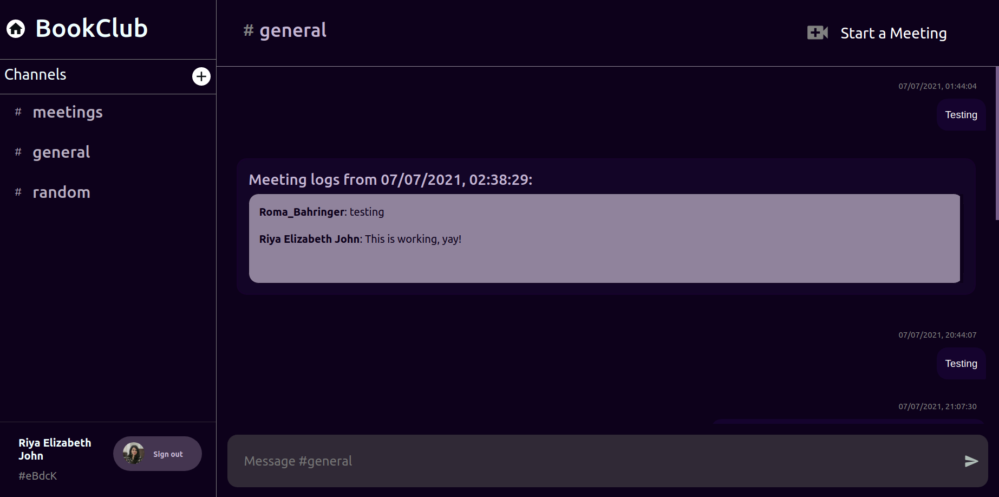

# Rooms

As a new user, you're automatically added to `BookClub`.
Let's say you enter `Bookclub` while testing Alexandria.

## Explore

- You'll see a list of `Channels` on the `Sidebar` navigation, a `Header`, and the `Chatbox`. The `ChatBox` contains the messages from Room Members, as well as `Meeting Logs` (messages exchanged during a meeting)

- `Channels` are a way of modularising conversation, keeping separate topics of collaboration in a room workspace.
- This concept is similar to that of the Teams App, wherein each Team maintained conversation and workspace associated to it's designated purpose.

- **For eg:** A college maintains a Room for each of their courses. Now each Room will have different Channels for different purposes. Say there is a channel "Exams" for exam-related conversation, another channel "Class" where students exchange classwork-associated doubts.

- As `BookClub` is a pre-existing room, some users are already here, and you can see their messages and channels created.
  (I have been testing Alexandria out with my friends and assigned Engage Mentor as well 😄)

- You can see each message sender's `profile picture`, `name`, and also `timestamp` of each message. Feel free to check the other channels out, create a new channel, and send some messages to test functionalities.

- You can also start a meeting from a room. The Meeting Logs will come up here after the conclusion of a meeting.

- You can sign-out from here too, and be redirected to Login UI.

## Working

- Made Custom React Components for aesthetic UI, for eg: the Chat Message UI. I have made good use of `@material-ui` and `mui-treasury` packages for building these.

- Flex has been applied on these React components to render `SideBar`, `ChatBox`, `Header` and `ChatInput`- and facilitate scrolling in both `Meeting Logs` box as well as the `ChatBox`

- `Redux` slice has been used to maintain state between Channels, and to enforce `DRY` principle of Agile Development.

        //appSlice.js

        import { createSlice } from '@reduxjs/toolkit';

        export const appSlice = createSlice({
        name: 'app',
        initialState: {
        channelId: "general",
        channelName: "general",
        },
        reducers: {
        setChannelInfo: (state, action) => {
        state.channelId = action.payload.channelId;
        state.channelName = action.payload.channelName;
        },
        },
        });

        export const { setChannelInfo } = appSlice.actions;
        export const selectChannelId = (state) => state.app.channelId;
        export const selectChannelName = (state) => state.app.channelName;
        export default appSlice.reducer;

- All messages of a particular Channel are stored as documents under collection `rooms\<roomID>\channels\<channelID>\messages\`.

## Troubleshooting

- If `Call Logs` do not show up after a meeting conclusion, please try again.
